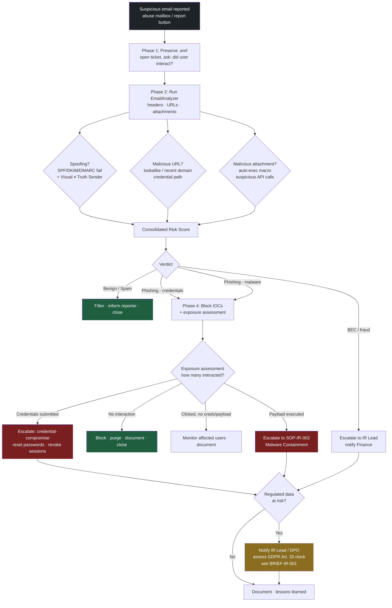

# Phishing Triage — Process Flow

> Companion diagram to [SOP-IR-001](../sops/SOP-IR-001_Phishing-Email-Triage.md).  
> Illustrative example. Contains no confidential or client-specific information.

This diagram shows the decision flow from a reported email to verdict, containment, and escalation.

## Reading the flow

- **Top half (Phases 1–3)** is pure analysis: preserve the evidence, run EmailAnalyzer, reach a verdict.
- **Bottom half (Phase 4 onward)** is where triage becomes incident response. The single most important branch is the **exposure assessment** — one reported email is not the incident; the campaign is.
- **Red nodes** are escalation points where the incident leaves L1/L2 hands.
- **Amber node** is the regulatory decision point that starts the GDPR clock — escalated immediately, never deferred to case closure.
