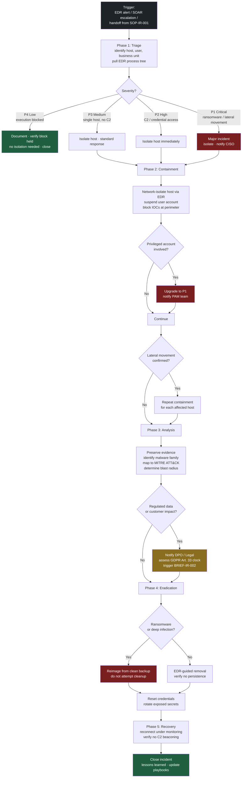

# Malware Containment — Process Flow

> Companion diagram to [SOP-IR-002](../sops/SOP-IR-002_Malware-Containment.md).  
> Illustrative example. Contains no confidential or client-specific information.

Unlike the phishing flow, this process is driven by **severity**: the same detection leads to very different responses depending on whether it is a blocked attachment (P4) or active ransomware (P1). Severity is assessed early and re-assessed continuously.

## Reading the flow

- **Severity is the first real decision**, not an afterthought. A P4 (execution blocked by EDR) closes in minutes; a P1 (ransomware) becomes a major incident with CISO involvement. Same alert source, completely different response.
- **Two points can escalate severity mid-incident**: a privileged account being involved, and confirmed lateral movement. Both pull the response up to P1 regardless of the initial assessment.
- **Red nodes** are the high-severity branches where the incident leaves routine handling.
- **Amber node** is the regulatory decision point — assessed during analysis, not at the end, because the GDPR clock starts on awareness.
- **Evidence is preserved before eradication** — a common failure mode is jumping straight to reimaging and destroying the forensic trail.
