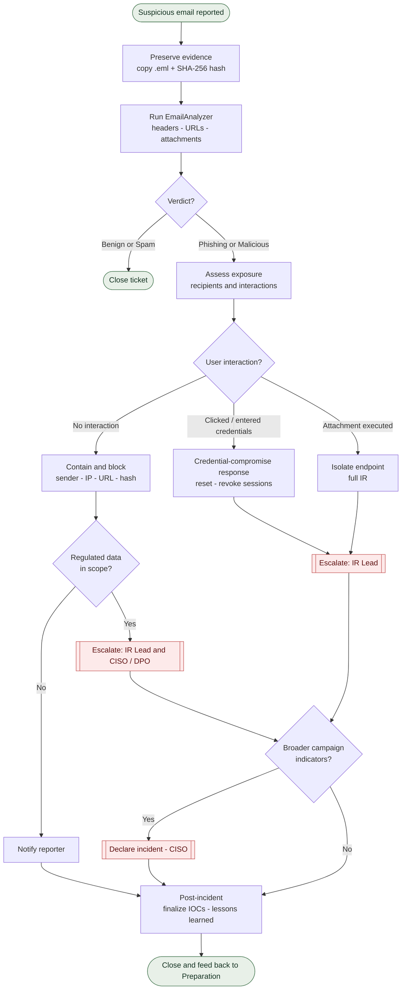

# Phishing Triage & Escalation — Process Flow

Visual representation of the triage and escalation logic in [SOP-IR-001](../sops/SOP-IR-001_Phishing-Email-Triage.md). Decision points are diamonds; escalation steps are highlighted; green nodes are start/end states.

